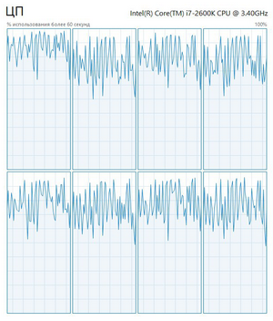
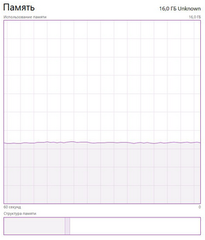
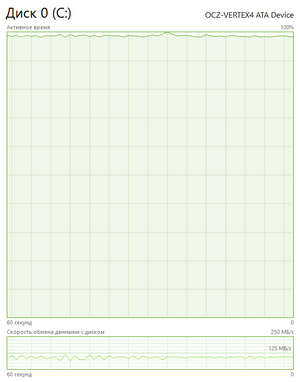
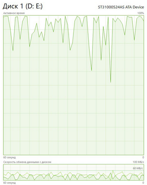

# GZipTest

Simple .NET 3.5 multi-threaded GZipStream-based compressor/decompressor w/o ThreadPool, BackgroundWorker, TPL, etc.

Test task from [Veeam® Software](https://www.veeam.com)

[Description of task (in russian :ru:)](task.md)

[Description of implementation (in russian :ru:)](impl.md)

## Performance tests

:computer: Testing PC hardware:

* CPU [Intel Core i7-2600K 3.40GHz](https://market.yandex.ru/product/6933502/spec?hid=91019&track=tabs)

* RAM [4 x 4 GB DDR3 1600 MHz](https://market.yandex.ru/product/6131982/spec?hid=191211&track=tabs)

* SSD [OCZ VTX4-25SAT3-128G](https://market.yandex.ru/product/7978930/spec?hid=91033&track=tabs)

* HDD [Seagate ST31000524AS](https://market.yandex.ru/product/6989302/spec?hid=91033&track=tabs)

### Testing on SSD

File format | Original size | Compressed size | Compression time | Decompression time | Compression efficiency
:---: | :---: | :---: | :---: | :---: | :---:
DOCX | 50 KB | 75 KB | 0.11 sec | 0.08 sec | 66 %
MP3 | 6 MB | 9.1 MB | 0.31 sec | 0.33 sec | 67 %
TXT | 136.6 MB | 59.3 MB | 1.8 sec | 1.6 sec | 230 %
AVI | 1.43 GB | 2.18 GB | 24 sec | 39.8 sec | 65 %
MKV | 28 GB | 41.2 GB | 8.7 min | 16.4 min | 67 %

### Testing on HDD

File format | Original size | Compressed size | Compression time | Decompression time | Compression efficiency
:---: | :---: | :---: | :---: | :---: | :---:
DOCX | 50 KB | 75 KB | 0.11 sec | 0.09 sec | 66 %
MP3 | 6 MB | 9.1 MB | 0.32 sec | 0.34 sec | 67 %
TXT | 136.6 MB | 59.3 MB | 2.32 sec | 1.98 sec | 230 %
AVI | 1.43 GB | 2.18 GB | 44.8 sec | 52.1 sec | 65 %
MKV | 28 GB | 41.2 GB | 18.5 min | 23.6 min | 67 %

Compression efficiency less than 100 % means extra size for compressed file. 
The reason for that is files are already compressed with more efficient algorithm. 
[GZip from .NET 3.5](https://msdn.microsoft.com/en-us/library/system.io.compression.gzipstream(v=vs.90).aspx) is useless, and it's just a wrapper for [Deflate](https://msdn.microsoft.com/en-us/library/system.io.compression.deflatestream(v=vs.90).aspx) compression algorithm. 
There is no even a parameter for optimal or fastest compression methods. :suspect:

### Load on hardware

:chart_with_upwards_trend: Charts of system resources using at runtime.

Application is trying to use CPU and disk on maximum, and required is only about 200 MB in RAM.

